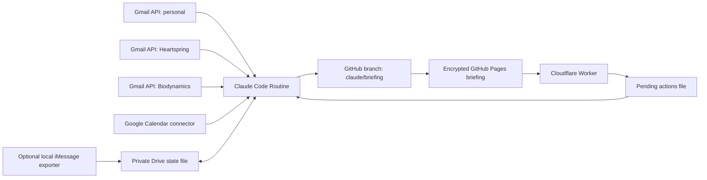

# Ben Assistant: Continuity + Multi-Gmail Implementation Guide

This guide upgrades the current daily Claude Code Routine from a fresh daily inbox report into a stateful personal assistant.

The target architecture is:

- Claude Code Routine runs daily at 4:30 PM America/New_York.
- Gmail is scanned directly through the Gmail API for every mailbox Ben uses.
- Google Calendar stays on the existing Claude connector, using Ben's main/calendar account.
- Durable assistant memory lives in a private Google Drive file owned by Ben's main account.
- GitHub Pages serves only the encrypted briefing page from a `claude/briefing` branch.
- Ben's clicks do not trigger Claude runs. They are written as small pending actions and consumed by the next scheduled run.

## 1. Final Architecture



## 2. What Changes From The Current Prompt

Remove these old assumptions:

- The connected Gmail account is the only source of email truth.
- Gmail `threadId` is the durable continuity key.
- The routine pushes directly to `main`.
- The routine generates one giant handwritten HTML file directly.
- Every run archive is committed forever.

Replace them with:

- Scan every Gmail account directly through the Gmail API.
- Use RFC822 email headers for continuity: `Message-ID`, `References`, and `In-Reply-To`.
- Deploy to `claude/briefing`.
- Claude outputs structured JSON; scripts validate, render, encrypt, and deploy.
- Keep durable state in private Drive, with a small rolling history only.

## 3. Repository Structure

Create this structure in the GitHub Pages repo:

```text
.
├── .nojekyll
├── package.json
├── schemas/
│   ├── briefing.schema.json
│   └── assistant-state.schema.json
├── prompts/
│   └── routine-prompt.md
├── src/
│   ├── gmail-api.mjs
│   ├── continuity.mjs
│   ├── render-briefing.mjs
│   ├── encrypt-page.mjs
│   ├── drive-state.mjs
│   └── deploy.mjs
└── dist/
    └── index.html
```

`dist/index.html` is copied or written to root `index.html` before deploy.

## 4. Claude Routine Configuration

In Claude Code Routines:

1. Trigger: daily at 4:30 PM America/New_York.
2. Repository: the GitHub Pages repo.
3. Branch permission: keep the default `claude/` restriction.
4. GitHub Pages source: set Pages to serve from `claude/briefing`, root folder.
5. Connectors:
   - Google Calendar on Ben's main account.
   - Google Drive on Ben's main account, if available for state reads/writes.
   - GitHub connector, if you want Claude to push through connector tooling.
6. Network access:
   - Add `gmail.googleapis.com`.
   - Add `oauth2.googleapis.com`.
   - Add the Cloudflare Worker domain if the routine needs to read pending actions from it.
7. Environment variables:

```text
BRIEFING_PASSWORD=...
STATE_ENCRYPTION_KEY=...
GOOGLE_OAUTH_CLIENT_ID=...
GOOGLE_OAUTH_CLIENT_SECRET=...
GMAIL_ACCOUNTS_JSON=...
DRIVE_STATE_FILE_ID=...
DRIVE_PENDING_ACTIONS_FILE_ID=...
GITHUB_PAGES_URL=https://USERNAME.github.io/REPO-NAME/
```

`GMAIL_ACCOUNTS_JSON` should look like this:

```json
[
  {
    "email": "bendavis354@gmail.com",
    "type": "Personal",
    "calendarHint": "Primary calendar",
    "refreshTokenEnv": "GMAIL_REFRESH_TOKEN_PERSONAL"
  },
  {
    "email": "ben@heartspringgardens.org",
    "type": "Business",
    "calendarHint": "Heartspring Gardens calendar",
    "refreshTokenEnv": "GMAIL_REFRESH_TOKEN_HEARTSPRING"
  },
  {
    "email": "benjamin@biodynamics.com",
    "type": "Business",
    "calendarHint": "Biodynamics calendar",
    "refreshTokenEnv": "GMAIL_REFRESH_TOKEN_BIODYNAMICS"
  }
]
```

Add each referenced refresh token as its own secret environment variable.

## 5. Gmail API Setup

Create one Google Cloud OAuth app and authorize each mailbox once.

Steps:

1. Open Google Cloud Console.
2. Create or select a project.
3. Enable the Gmail API.
4. Configure OAuth consent screen.
5. Create OAuth Client ID. A desktop app client is easiest for manual token generation.
6. Authorize each Gmail account.
7. Store each refresh token in Claude Routine environment variables.

Use read-only scopes unless you have a specific reason to expand:

```text
https://www.googleapis.com/auth/gmail.readonly
```

If you only need headers and labels, `gmail.metadata` may be enough, but `gmail.readonly` is more practical because the assistant needs snippets/body excerpts for summarization.

Important: put the OAuth app into production once testing is done. OAuth apps left in testing can have short-lived refresh behavior.

## 6. Gmail API Scanner

Create `src/gmail-api.mjs`:

```js
const GMAIL_BASE = 'https://gmail.googleapis.com/gmail/v1/users/me';
const TOKEN_URL = 'https://oauth2.googleapis.com/token';

const METADATA_HEADERS = [
  'Message-ID',
  'References',
  'In-Reply-To',
  'From',
  'To',
  'Cc',
  'Subject',
  'Date',
  'Delivered-To',
  'X-Original-To',
  'Reply-To'
];

export async function getAccessToken({ clientId, clientSecret, refreshToken }) {
  const body = new URLSearchParams({
    client_id: clientId,
    client_secret: clientSecret,
    refresh_token: refreshToken,
    grant_type: 'refresh_token'
  });

  const res = await fetch(TOKEN_URL, {
    method: 'POST',
    headers: { 'content-type': 'application/x-www-form-urlencoded' },
    body
  });

  if (!res.ok) {
    throw new Error(`OAuth refresh failed: ${res.status} ${await res.text()}`);
  }

  const json = await res.json();
  return json.access_token;
}

export async function listMessages({ accessToken, query, max = 100 }) {
  const out = [];
  let pageToken;

  while (out.length < max) {
    const url = new URL(`${GMAIL_BASE}/messages`);
    url.searchParams.set('q', query);
    url.searchParams.set('maxResults', String(Math.min(100, max - out.length)));
    if (pageToken) url.searchParams.set('pageToken', pageToken);

    const res = await fetch(url, {
      headers: { authorization: `Bearer ${accessToken}` }
    });

    if (!res.ok) {
      throw new Error(`Gmail list failed: ${res.status} ${await res.text()}`);
    }

    const json = await res.json();
    out.push(...(json.messages || []));
    pageToken = json.nextPageToken;
    if (!pageToken) break;
  }

  return out;
}

export async function getMessage({ accessToken, id, sourceAccount }) {
  const url = new URL(`${GMAIL_BASE}/messages/${id}`);
  url.searchParams.set('format', 'metadata');
  for (const h of METADATA_HEADERS) url.searchParams.append('metadataHeaders', h);

  const res = await fetch(url, {
    headers: { authorization: `Bearer ${accessToken}` }
  });

  if (!res.ok) {
    throw new Error(`Gmail get failed: ${res.status} ${await res.text()}`);
  }

  const msg = await res.json();
  const headers = Object.fromEntries(
    (msg.payload?.headers || []).map(h => [h.name.toLowerCase(), h.value])
  );

  return {
    sourceAccount,
    gmailMessageId: msg.id,
    gmailThreadId: msg.threadId,
    labelIds: msg.labelIds || [],
    snippet: msg.snippet || '',
    internalDate: msg.internalDate ? Number(msg.internalDate) : null,
    rfcMessageId: normalizeMsgId(headers['message-id']),
    references: parseReferences(headers.references),
    inReplyTo: normalizeMsgId(headers['in-reply-to']),
    from: headers.from || '',
    to: headers.to || '',
    cc: headers.cc || '',
    subject: headers.subject || '',
    date: headers.date || '',
    deliveredTo: headers['delivered-to'] || '',
    originalTo: headers['x-original-to'] || '',
    replyTo: headers['reply-to'] || ''
  };
}

export async function scanMailbox({ account, clientId, clientSecret, refreshToken }) {
  const accessToken = await getAccessToken({ clientId, clientSecret, refreshToken });

  const queries = [
    'newer_than:2d',
    'in:sent newer_than:14d'
  ];

  const ids = new Map();
  for (const query of queries) {
    const messages = await listMessages({ accessToken, query, max: 250 });
    for (const m of messages) ids.set(m.id, m);
  }

  const full = [];
  for (const id of ids.keys()) {
    full.push(await getMessage({ accessToken, id, sourceAccount: account.email }));
  }

  return full;
}

function normalizeMsgId(value) {
  if (!value) return '';
  const match = String(value).match(/<[^>]+>/);
  return (match ? match[0] : value).trim().toLowerCase();
}

function parseReferences(value) {
  if (!value) return [];
  return [...String(value).matchAll(/<[^>]+>/g)].map(m => m[0].toLowerCase());
}
```

The Gmail API `users.messages.get` endpoint supports `format=metadata` and `metadataHeaders[]`, which lets the routine fetch only the headers it needs plus Gmail metadata.

## 7. Conversation Continuity

Create `src/continuity.mjs`:

```js
export function buildConversationKey(message) {
  if (message.references?.length) return message.references[0];
  if (message.inReplyTo) return message.inReplyTo;
  if (message.rfcMessageId) return message.rfcMessageId;
  return fallbackMessageKey(message);
}

export function dedupeMessages(messages) {
  const byKey = new Map();

  for (const msg of messages) {
    const key = msg.rfcMessageId || fallbackMessageKey(msg);
    const existing = byKey.get(key);

    if (!existing) {
      byKey.set(key, msg);
      continue;
    }

    byKey.set(key, preferOriginalOverForward(existing, msg));
  }

  return [...byKey.values()];
}

export function groupConversations(messages, benAccounts) {
  const conversations = new Map();

  for (const msg of messages) {
    const key = buildConversationKey(msg);
    if (!conversations.has(key)) {
      conversations.set(key, {
        conversationKey: key,
        accountsSeen: new Set(),
        messages: []
      });
    }

    const convo = conversations.get(key);
    convo.accountsSeen.add(msg.sourceAccount);
    convo.messages.push({
      ...msg,
      fromMe: isFromBen(msg.from, benAccounts)
    });
  }

  for (const convo of conversations.values()) {
    convo.accountsSeen = [...convo.accountsSeen];
    convo.messages.sort((a, b) => (a.internalDate || 0) - (b.internalDate || 0));
    convo.status = inferStatus(convo);
    convo.latestMessage = convo.messages[convo.messages.length - 1];
  }

  return [...conversations.values()];
}

export function inferStatus(convo) {
  const latest = convo.messages[convo.messages.length - 1];
  if (!latest) return 'unknown';
  if (latest.fromMe) return 'waiting_on_other';
  if (looksNoReplyNeeded(latest)) return 'fyi';
  return 'waiting_on_ben';
}

function isFromBen(fromHeader, benAccounts) {
  const from = String(fromHeader).toLowerCase();
  return benAccounts.some(email => from.includes(email.toLowerCase()));
}

function looksNoReplyNeeded(msg) {
  const labels = msg.labelIds || [];
  const subject = String(msg.subject || '').toLowerCase();
  return (
    labels.includes('CATEGORY_PROMOTIONS') ||
    labels.includes('CATEGORY_SOCIAL') ||
    subject.includes('newsletter') ||
    subject.includes('receipt') ||
    subject.includes('no-reply') ||
    String(msg.from || '').toLowerCase().includes('no-reply')
  );
}

function fallbackMessageKey(msg) {
  const dateBucket = msg.internalDate ? Math.floor(msg.internalDate / 60000) : '';
  return [
    clean(msg.from),
    clean(msg.subject),
    dateBucket,
    clean(msg.snippet).slice(0, 120)
  ].join('|');
}

function preferOriginalOverForward(a, b) {
  const aForwarded = looksForwarded(a);
  const bForwarded = looksForwarded(b);
  if (aForwarded && !bForwarded) return b;
  return a;
}

function looksForwarded(msg) {
  const delivered = `${msg.deliveredTo} ${msg.originalTo}`.toLowerCase();
  return delivered && delivered.includes(msg.sourceAccount.toLowerCase()) === false;
}

function clean(value) {
  return String(value || '').trim().toLowerCase().replace(/\s+/g, ' ');
}
```

Key idea: Gmail `threadId` is still useful as a link target, but it is not the cross-account identity. Cross-account continuity uses RFC822 headers.

## 8. Durable State Shape

Store this in a private Google Drive file, not GitHub:

```json
{
  "version": 1,
  "updatedAt": "2026-05-31T20:30:00-04:00",
  "openTasks": [],
  "ignoredConversations": {},
  "snoozedConversations": {},
  "conversations": {
    "<root-message-id@example.com>": {
      "conversationKey": "<root-message-id@example.com>",
      "firstSeen": "2026-05-29",
      "lastSeen": "2026-05-31",
      "status": "waiting_on_ben",
      "accountsSeen": ["ben@heartspringgardens.org"],
      "latestRfcMessageId": "<latest@example.com>",
      "latestGmailLinks": [
        {
          "account": "ben@heartspringgardens.org",
          "gmailThreadId": "..."
        }
      ],
      "summary": "Short durable summary of the ongoing conversation.",
      "manualNotes": [],
      "lastSuggestedReply": "",
      "nextFollowUpDate": null
    }
  },
  "people": {},
  "preferences": {
    "timezone": "America/New_York",
    "replyStyle": "warm, concise, practical",
    "defaultCalendarAccount": "bendavis354@gmail.com"
  },
  "recentRuns": []
}
```

Keep `recentRuns` to a rolling window, such as 7 or 14 entries. Do not commit daily private archives to git.

## 9. Pending Actions

Ben's page can record manual actions:

- `ignore_conversation`
- `snooze_conversation`
- `mark_done`
- `mark_important`
- `note`

Shape:

```json
{
  "version": 1,
  "actions": [
    {
      "id": "uuid",
      "createdAt": "2026-05-31T21:08:00Z",
      "type": "snooze_conversation",
      "conversationKey": "<root-message-id@example.com>",
      "until": "2026-06-03",
      "source": "briefing-page"
    }
  ]
}
```

The Cloudflare Worker or equivalent endpoint appends actions here. The scheduled routine applies them once, updates Drive state, and clears the pending list.

Do not trigger a Claude Routine for each click.

## 10. Briefing JSON Schema

Create `schemas/briefing.schema.json`:

```json
{
  "$schema": "https://json-schema.org/draft/2020-12/schema",
  "type": "object",
  "required": ["metadata", "stats", "accounts", "sections"],
  "properties": {
    "metadata": {
      "type": "object",
      "required": ["generatedAt", "date", "timezone", "lastSuccessfulBuildAt", "dataFreshThrough"],
      "properties": {
        "generatedAt": { "type": "string" },
        "date": { "type": "string" },
        "timezone": { "type": "string" },
        "lastSuccessfulBuildAt": { "type": "string" },
        "dataFreshThrough": { "type": "string" },
        "liveUrl": { "type": "string" }
      }
    },
    "stats": {
      "type": "object",
      "required": ["emailsScanned", "urgent", "eventsTomorrow", "proposedEvents", "suggestedReplies", "todos"],
      "properties": {
        "emailsScanned": { "type": "number" },
        "urgent": { "type": "number" },
        "eventsTomorrow": { "type": "number" },
        "proposedEvents": { "type": "number" },
        "suggestedReplies": { "type": "number" },
        "todos": { "type": "number" }
      }
    },
    "accounts": {
      "type": "array",
      "items": {
        "type": "object",
        "required": ["email", "label"],
        "properties": {
          "email": { "type": "string" },
          "label": { "type": "string" }
        }
      }
    },
    "sections": {
      "type": "object",
      "properties": {
        "urgent": { "type": "array" },
        "tomorrowSchedule": { "type": "array" },
        "calendarProposals": { "type": "array" },
        "suggestedReplies": { "type": "array" },
        "todos": { "type": "array" },
        "business": { "type": "array" },
        "personal": { "type": "array" },
        "financial": { "type": "array" },
        "waiting": { "type": "array" },
        "newsletter": { "type": "array" },
        "spam": { "type": "array" }
      }
    }
  }
}
```

## 11. Deterministic Render + Encryption

Claude should produce `briefing.json`. Code should validate and render it.

Install:

```json
{
  "type": "module",
  "scripts": {
    "build": "node src/render-briefing.mjs && node src/encrypt-page.mjs",
    "deploy": "node src/deploy.mjs"
  },
  "dependencies": {
    "ajv": "^8.17.1"
  }
}
```

The renderer should:

- Validate `briefing.json`.
- Escape all user-provided text.
- Render stable sections and CSS.
- Include `id="tomorrow-schedule"`.
- Use only `<a target="_blank">` for external navigation.
- Never use `window.open()`.
- Stamp the page with `generatedAt` and `dataFreshThrough`.
- Show a stale-data warning if the build date is not today.

The encryption script should:

- Read rendered plaintext HTML from a temp or ignored file.
- Encrypt with AES-256-GCM.
- Derive the key from `BRIEFING_PASSWORD`.
- Write only encrypted `index.html` to the repo root.

Do not commit plaintext briefing content.

## 12. Deployment

Routine deploys to `claude/briefing`:

```bash
git checkout -B claude/briefing
git add index.html .nojekyll
git commit -m "Briefing update: $(date +%Y-%m-%d)" || true
git push origin claude/briefing --force-with-lease
```

GitHub Pages should be configured to serve from:

```text
Branch: claude/briefing
Folder: /
```

This avoids granting the routine unrestricted pushes to `main`.

## 13. Replacement Routine Prompt

Use this as the new routine prompt.

```text
Daily Inbox Briefing — Ben Assistant Routine

You are Ben's personal inbox and schedule assistant. This routine runs every day at 4:30 PM America/New_York in Claude Code Routines.

CRITICAL RULES
- Do not send emails.
- Do not create Gmail drafts.
- Do not create calendar events directly.
- Do not push to main.
- Deploy only by pushing index.html and .nojekyll to the claude/briefing branch.
- Never commit plaintext briefing content, durable memory, tokens, or private email data.
- The final public page must be encrypted with the configured briefing password.

AVAILABLE SOURCES
- Gmail API scanner code in this repo reads all configured Gmail accounts from environment variables.
- Google Calendar connector is connected to Ben's main account and can list all calendars visible to that account.
- Google Drive connector is connected to Ben's main account and stores private assistant state.
- GitHub repo is used only for the encrypted GitHub Pages briefing.

TODAY/TOMORROW
- Determine today and tomorrow in America/New_York.
- Use exact dates in all output and calculations.

STEP 1 — LOAD STATE
- Read the private assistant state JSON from Google Drive.
- Read pending actions JSON from Google Drive or the configured pending-actions source.
- Apply pending actions to state:
  - ignore_conversation
  - snooze_conversation
  - mark_done
  - mark_important
  - note
- Clear pending actions only after the final briefing and state update succeed.

STEP 2 — SCAN ALL GMAIL ACCOUNTS
- Run the repository Gmail API scanner for every account configured in GMAIL_ACCOUNTS_JSON.
- Scan:
  - recent messages newer_than:2d
  - sent mail newer_than:14d
  - any open conversations from durable state that need re-checking
- Extract:
  - sourceAccount
  - gmailMessageId
  - gmailThreadId
  - RFC Message-ID
  - References
  - In-Reply-To
  - From, To, Cc, Subject, Date
  - snippet
  - internalDate
  - labels

STEP 3 — DEDUPE AND BUILD CROSS-ACCOUNT CONVERSATIONS
- Deduplicate messages by RFC Message-ID when available.
- Prefer original mailbox copies over forwarded duplicates.
- Build conversationKey using:
  1. first References header ID
  2. In-Reply-To
  3. Message-ID
  4. fallback sender + subject + timestamp + snippet
- Do not use Gmail threadId as the global continuity key.
- Keep Gmail threadId only for account-specific Gmail links.

STEP 4 — INFER CONTINUITY
- For each conversation, infer status from reality:
  - if latest relevant message is from Ben, status is waiting_on_other
  - if latest relevant message is from someone else and needs action, status is waiting_on_ben
  - newsletters, receipts, promotions, and no-reply messages are fyi unless clearly actionable
- Respect durable state:
  - ignored conversations stay hidden unless newly important
  - snoozed conversations stay hidden until their snooze date
  - manual notes and importance are preserved

STEP 5 — SCAN CALENDAR
- List all calendars visible to Ben's main account.
- For each calendar, list tomorrow's events from 00:00:00 through 23:59:59 America/New_York.
- Merge into a chronological schedule.
- Track title, start, end, location, calendar name, calendarId, htmlLink, attendees.

STEP 6 — CLASSIFY EMAILS
Classify each non-duplicate conversation into one bucket:
- urgent
- business
- personal
- financial
- newsletter/info
- waiting/fyi
- spam/junk

For non-spam conversations, identify:
- calendar event candidates
- suggested replies
- to-do items
- follow-up dates

STEP 7 — GENERATE STRUCTURED BRIEFING JSON
- Write briefing.json matching schemas/briefing.schema.json.
- Include metadata:
  - generatedAt
  - date
  - timezone
  - lastSuccessfulBuildAt
  - dataFreshThrough
  - liveUrl
- Include source counts and account totals.
- Include conversationKey on every item that came from email.
- Include sourceAccount and originalRecipient when known.
- Include Gmail links with account-specific thread IDs.

STEP 8 — VALIDATE, RENDER, ENCRYPT
- Run npm install if needed.
- Run npm run build.
- If schema validation fails, stop and report failure.
- The rendered encrypted index.html must include:
  - password gate
  - last successful build timestamp
  - stale-data warning when appropriate
  - account filters
  - tomorrow schedule with id="tomorrow-schedule"
  - addToSchedule and updateCalLink JS functions
  - all external actions as <a target="_blank"> links
  - no window.open()

STEP 9 — UPDATE PRIVATE STATE
- Update assistant-state.json in Google Drive.
- Keep durable summaries compact.
- Keep recentRuns rolling, maximum 14.
- Do not store full email bodies unless absolutely necessary.
- Clear pending actions after state and briefing are successfully updated.

STEP 10 — DEPLOY
- Ensure .nojekyll exists.
- Commit index.html and .nojekyll only.
- Push to claude/briefing.
- Do not open a PR.
- Do not merge anything into main.

STEP 11 — PRINT SUMMARY
Print:
---
BRIEFING SUMMARY
Date: [today]
Emails scanned: [N]
Accounts: [list]
Conversations after dedupe: [N]
Pending actions applied: [N]
Urgent: [N]
Calendar events tomorrow: [N]
Proposed new events: [N]
Suggested replies: [N]
To-dos: [N]
State updated: yes/no
Live at: [GITHUB_PAGES_URL]
---
```

## 14. Cloudflare Worker for Click Actions

Use this only for Ben's browser clicks. It does not run Claude.

Recommended first version:

- Worker validates a shared secret.
- Worker accepts a small action payload.
- Worker appends it to `pending-actions.json`.
- The next scheduled routine applies the actions.

If writing to Google Drive from the Worker is inconvenient, write to a private GitHub file with a fine-grained token. If you do that, keep payloads minimal and avoid private email text.

Example payload:

```json
{
  "type": "snooze_conversation",
  "conversationKey": "<abc@example.com>",
  "until": "2026-06-03"
}
```

The briefing page should call the Worker with `fetch`, then update the UI locally.

## 15. iMessage Later

Add iMessage only after the assistant state loop is working.

The clean pattern:

- A local Mac scheduled task exports recent iMessage metadata/summaries.
- It encrypts locally.
- It writes to the same Drive folder or to a safe endpoint.
- The cloud routine reads the exported file during Step 1.

Do not try to make the cloud routine read iMessage directly. It cannot access Ben's Mac Messages database.

## 16. Implementation Order

1. Change GitHub Pages to serve from `claude/briefing`.
2. Add JSON schema + deterministic renderer + encryption script.
3. Move durable state to private Drive.
4. Add Gmail API scanner for one secondary account.
5. Add all remaining Gmail accounts.
6. Add dedupe and cross-account conversation keys.
7. Add status inference from sent mail.
8. Add pending actions file.
9. Add Worker write-back.
10. Add iMessage exporter later.

## 17. Security Checklist

- No refresh tokens in git.
- No plaintext briefing in git.
- No private state in git history.
- No unrestricted push to main.
- No email send/draft scopes.
- No calendar write API actions.
- Routine environment allows only required outbound domains.
- Page displays stale-build warning.
- Renderer validates JSON and fails loudly.
- Recent run history is rolling, not permanent.

## 18. References

- Claude Code Routines docs: https://code.claude.com/docs/en/routines
- Claude Code on the web/cloud behavior: https://code.claude.com/docs/en/claude-code-on-the-web
- Gmail API `users.messages.get`: https://developers.google.com/workspace/gmail/api/reference/rest/v1/users.messages/get

